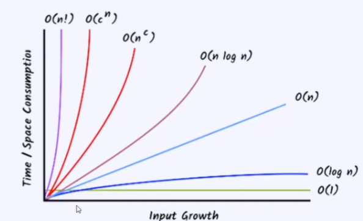

Big(O) notations: 
 
• 0(1) — Constant
 
• O(logn) — Logarithmic
 
• O(n)— Linear
 
• O(nlogn) — Linearithmic
 
• O(nc) — Polynomial Like Quadratic (n2), Cubic (n3) etc.
 
• O(cn) — Exponential (P)
 
• O(n!) — Factorial
 
When we see this image we can know that the time complexity increases with the input that is given.
 
Factorial for the smaller input has the highest time complexion.Meaning it takes more time even for a small input because the calculations take up a lot of time

