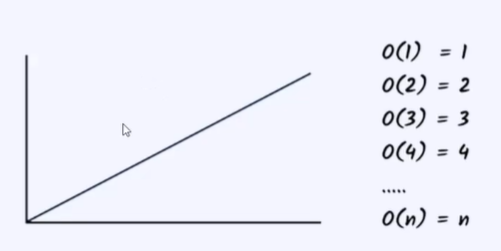

In O(n) time complexity, the time complexity increases as the input increases.
 
If the number of inputs increases then the time of the process increases
 
Example of this notation is printing all the elements in the array looping all the elements in the array:
 
int [] = array = {10,20,30,40};
 
for(int i = 0; i < array.length; i++){
     
    System.out.println(array[i]);
}
 
