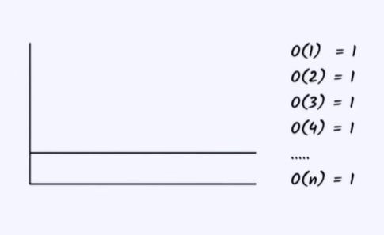

This type of notation is time independent.(It takes same time for any input).
 
Input size doesn't matter time remains constant same.
 
Example accessing the elements of the array.
 
#Code for the big O1 notation
 
int[] array = {1,2,3,4,5};
 
System.out.println(array[1]);//To give any index it will take the same amount of time
 
 
 
