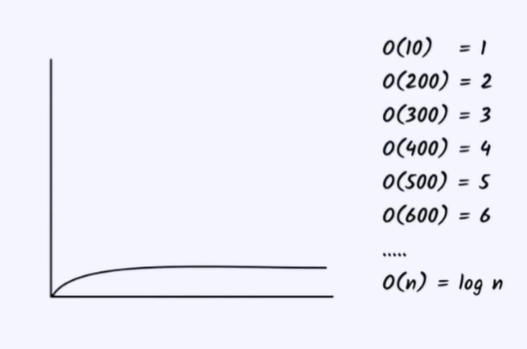

In this log(n) complexity the time increases linearly but the input varies exponentially
 
This means that for the larger input the value is lesser and the time taken is lesser.
 
Example code:
 
int n = 10;
 
for(int i = 0;i < n ; i = i*10){
 
//The input given here is larger i = i * 10;
 
//The output given here is small only i is given.
 
    System.out.println(i);
}
 
It might seem that it is raising exponentially, but the output is increasing linearly
 
